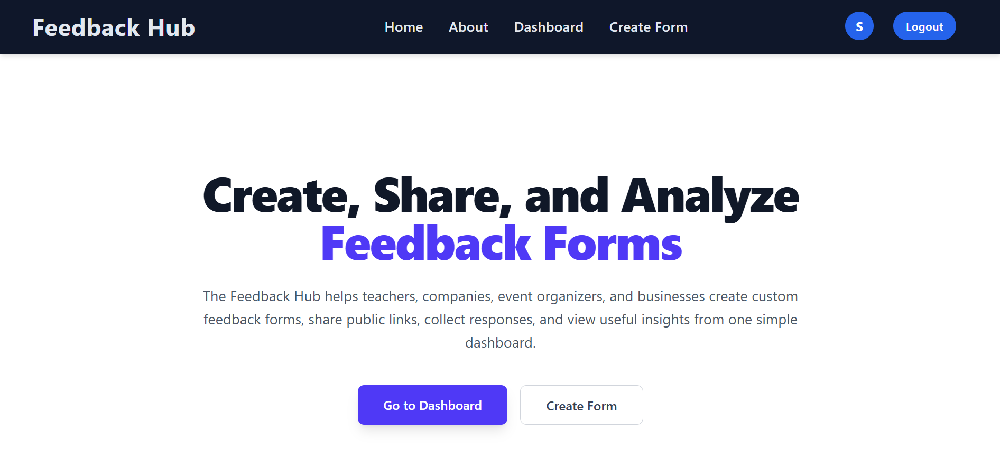
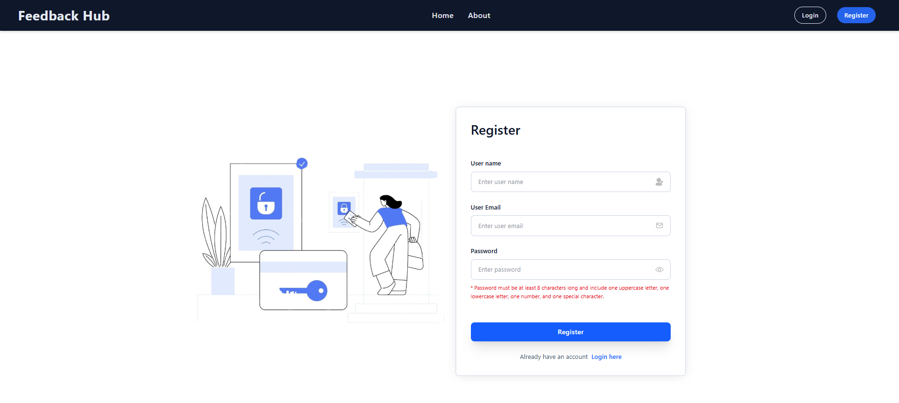
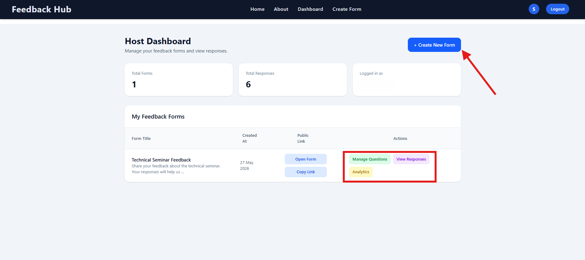
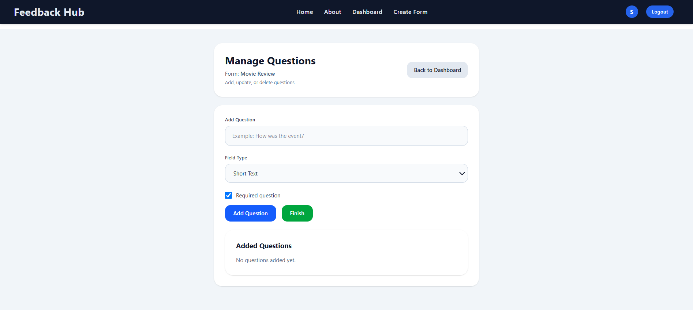
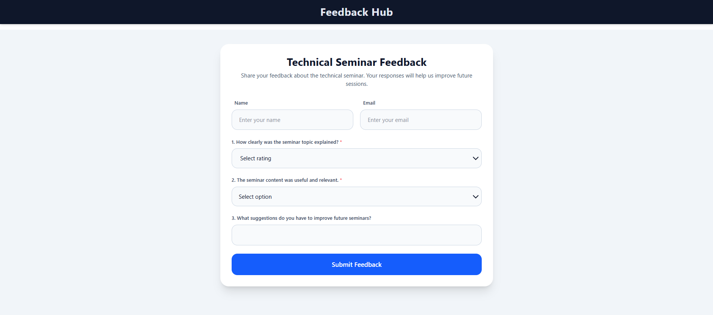
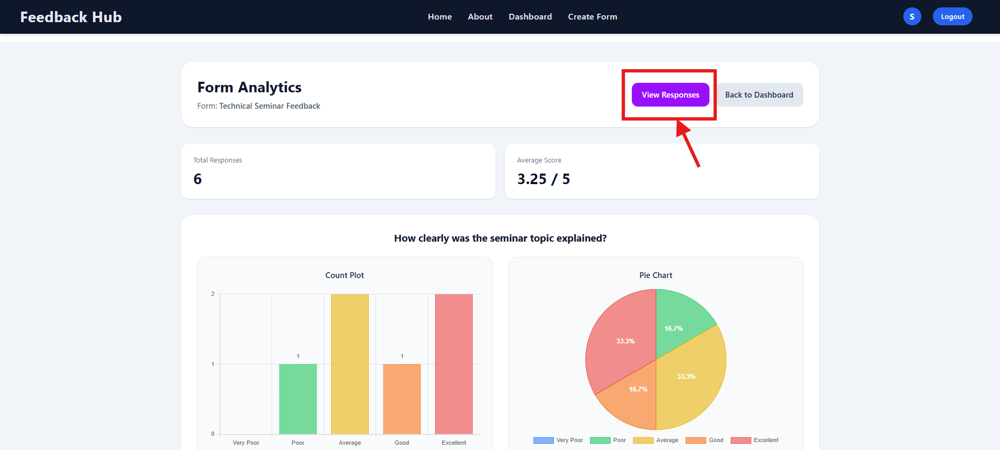
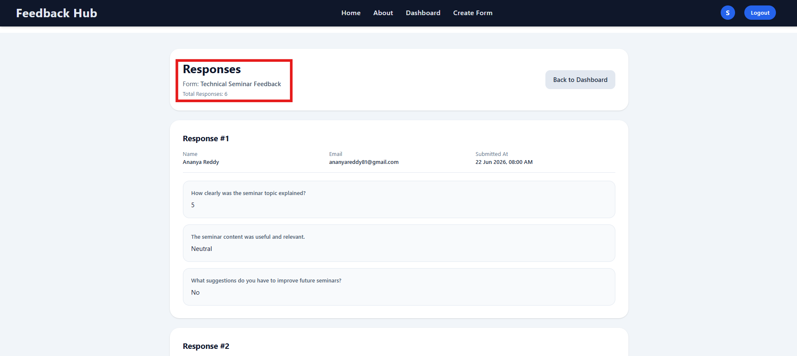

# 🚀 Feedback Hub

**Feedback Hub** is a full-stack web application designed to streamline the process of collecting, managing, and analyzing feedback. The platform enables users to create customizable feedback forms, share them through public links, gather responses efficiently, and gain valuable insights through interactive analytics dashboards.

Built with a focus on usability, security, and scalability, Feedback Hub provides a seamless experience for both form creators and respondents.

---

## 🌐 Live Demo

**Application:** https://feedback-hub-145l.onrender.com/

---


## 📸 Application Screenshots

### 🏠 Home Page
The landing page of Feedback Hub, introducing the platform and allowing users to create, manage, and analyze feedback forms.



---

### 🔐 Authentication System
Secure user registration, login, and OTP-based password reset functionality to ensure account security.



---

### 📊 Host Dashboard
A centralized dashboard where users can create forms, manage feedback, access analytics, and view responses.



---

### ❓ Question Management
Dynamic form builder supporting multiple question types with options to add, edit, and delete questions.



---

### 📝 Public Feedback Form
A clean and responsive interface that allows users to submit feedback through a shareable public link.



---

### 📈 Analytics Dashboard
Interactive visualizations including bar charts, pie charts, response statistics, and average ratings.



---

### 📋 Response Management
View and manage all submitted responses in an organized manner for effective feedback analysis.



---

## 📌 Key Features

### User Authentication & Security

* Secure User Registration and Login
* Session-Based Authentication
* OTP-Based Password Reset via Email
* Protected User Dashboards
* Secure Password Hashing

### Feedback Form Management

* Create and Manage Feedback Forms
* Dynamic Question Creation
* Edit Existing Questions
* Delete Questions
* Form Ownership Validation

### Multiple Question Types

* Short Text Input
* Long Text Area
* Numeric Input
* Rating Scale (1–5)
* Radio Buttons (Yes/No)
* Dropdown-Based Feedback Options

### Feedback Collection

* Public Shareable Form Links
* User-Friendly Submission Interface
* Thank You Confirmation Page
* Real-Time Response Storage

### Analytics & Reporting

* Total Response Tracking
* Average Rating Calculation
* Interactive Bar Charts
* Interactive Pie Charts
* Visual Response Analysis Dashboard

### Response Management

* View All Submitted Responses
* Organize Responses by Form
* Monitor User Feedback Efficiently

---

## 🛠 Technology Stack

### Backend

* Python
* Django

### Frontend

* HTML5
* CSS3
* JavaScript
* Tailwind CSS

### Database

* SQLite

### Data Visualization

* Chart.js
* Matplotlib

### Email Integration

* SMTP Email Services
* OTP Verification System

### Deployment

* Render

---

## 📊 System Workflow

```text
User Authentication
        │
        ▼
Host Dashboard
        │
        ├── Create Feedback Form
        ├── Manage Questions
        ├── View Responses
        └── Analyze Feedback
        │
        ▼
Public Feedback Form
        │
        ▼
Response Collection
        │
        ▼
Analytics Dashboard
```

---

## 🔒 Security Features

* CSRF Protection
* Session-Based Authentication
* OTP Verification System
* Secure Password Storage
* User Authorization Controls
* Form Ownership Validation

---

## 👨‍💻 Developer

**Suman Sett**

Email: [sumansett4@gmail.com](mailto:sumansett4@gmail.com)

---
